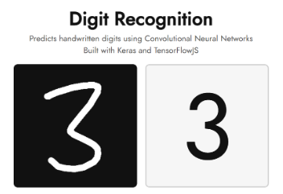
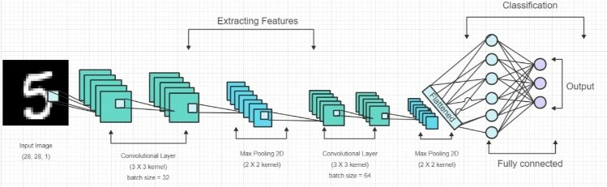
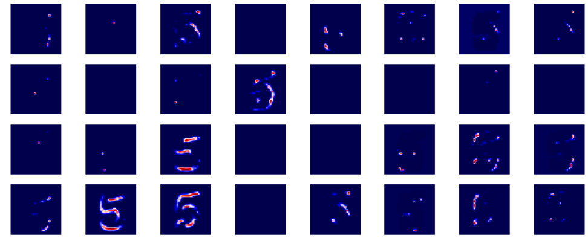
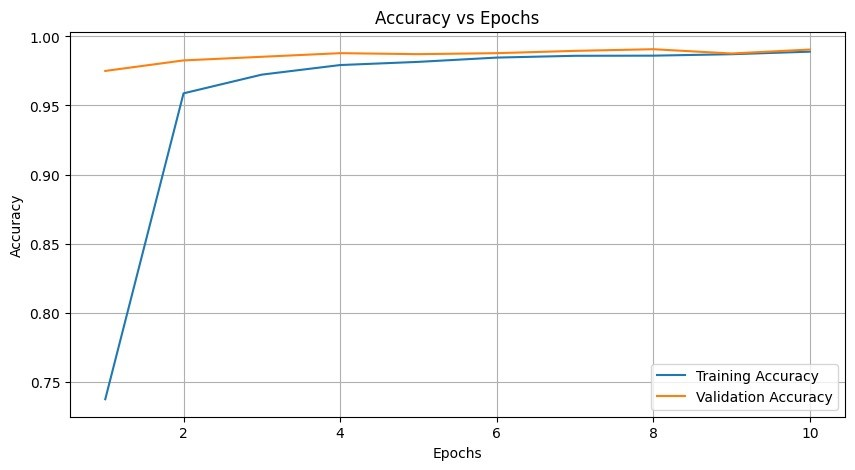
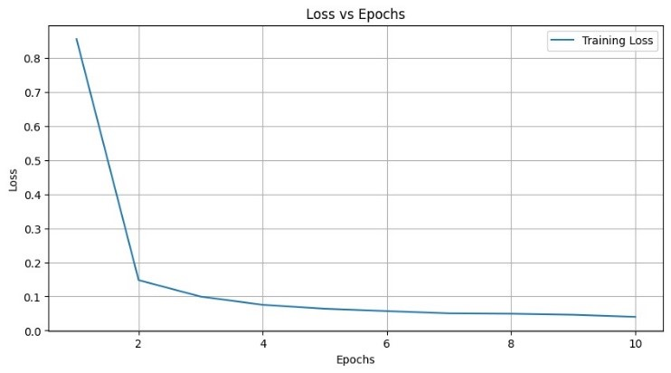

# **Digit Recognition using eXplainable AI (XAI)**

  

---

### **Abstract**
Handwritten digit recognition stands as a cornerstone in machine learning and computer vision, with diverse applications ranging from postal automation to digitizing historical documents. This project presents an innovative approach to recognizing handwritten digits through a custom-designed Convolutional Neural Network (CNN) model, enhanced by eXplainable Artificial Intelligence (XAI) techniques. Our model not only achieves high accuracy but also offers interpretable insights into its decision-making process, ensuring transparency and trust in the system's predictions. We demonstrate the effectiveness of this approach on benchmark datasets, achieving superior accuracy and enhanced model explainability.

**Keywords:** HDR, Deep Learning, CNN, MNIST, XAI

---

### **Introduction**
Handwritten digit recognition has been a challenging problem in pattern recognition and machine learning for decades. Traditional methods relied on handcrafted features and shallow learning models, but recent advancements in deep learning, particularly CNNs, have revolutionized the field by enabling end-to-end learning from raw pixel data. Despite their remarkable performance, CNNs often lack interpretability, making it difficult to understand their predictions. 

In this project, we address this issue by proposing a novel approach that combines the power of deep learning with the transparency of XAI techniques. We designed a custom CNN architecture specifically for digit recognition tasks, trained it on large-scale datasets, and achieved state-of-the-art accuracy. Additionally, we integrated XAI techniques like saliency maps, class activation maps, and Grad-CAM to visualize and understand the regions of input images contributing most to the model's predictions, enhancing transparency and trust in the system.

---

### **Methodology**
#### **A. Data Preprocessing**
- Handwritten digit images are preprocessed for consistency and uniformity.
- Images are resized to a standard dimension and normalized to a [0, 1] range.
- Data augmentation techniques such as rotation, shifting, and flipping are applied to diversify training samples and improve model generalization.

#### **B. Model Architecture Design**
- A custom CNN architecture is designed for digit recognition.
- The model includes multiple convolutional layers followed by max-pooling layers for feature extraction and spatial downsampling.
- ReLU activation is applied to introduce non-linearity, enhancing model expressiveness.
- Dropout layers are incorporated to mitigate overfitting by randomly deactivating neurons during training.

#### **C. Model Training**
- The CNN model is compiled with a suitable loss function, optimizer, and evaluation metrics.
- Training data is fed into the model in batches, and backpropagation updates model parameters.
- Hyperparameters like learning rate, batch size, and epochs are tuned through experimentation to optimize performance.
- Early stopping and learning rate reduction methods are implemented to avoid overfitting and improve model convergence.

#### **D. Model Evaluation**
- The trained model is evaluated on a validation dataset using metrics like accuracy, precision, recall, and F1-score.
- Cross-validation techniques such as k-fold validation are employed for robust performance estimation.
- Confusion matrices are analyzed to identify patterns or discrepancies in model predictions.

#### **E. Explainability Analysis**
- XAI techniques are utilized to interpret the CNN model's decision-making process.
- Outputs of each convolutional layer are visualized to understand feature detection.
- Activation maps highlight regions of input images contributing most to the model's predictions, providing valuable insights.

---

### **Model Architecture Overview**

  

The CNN model architecture is structured to effectively perform image classification tasks, with a well-balanced combination of convolutional, pooling, and fully connected layers. 

**Layers Breakdown:**
1. **Input Layer:** Receives the grayscale input of size (28, 28, 1), representing a 28x28 pixel image with a single channel.
2. **Convolutional Layers:** Three layers with ReLU activation; the first layer has 32 filters with (3, 3) kernel size and "same" padding. Subsequent layers double the filters for enhanced feature representation.
3. **Pooling Layers:** Each convolutional layer is followed by max-pooling layers with (2, 2) pool size, reducing spatial dimensions while retaining key features.
4. **Dropout Layers:** Dropout layers with a 0.25 rate are introduced after pooling layers to prevent overfitting.
5. **Flatten Layer:** Flattens the 2D feature maps into 1D vectors for input into fully connected layers.
6. **Fully Connected Layers:** Two dense layers (256 and 10 neurons) are used for classification, with ReLU activation followed by a softmax function.
7. **Output Layer:** Softmax function produces class probability distribution across 10 classes.

---

### **XAI Integration**
The project integrates XAI techniques to provide transparency and interpretability in the CNN model's decision-making process. Activations from each convolutional layer are visualized, revealing how the model interprets and transforms input images at different stages. These visualizations offer stakeholders a deeper understanding of the model's reasoning, facilitating trust and usability in AI systems.

  

---

### **Results and Analysis**
#### **A. Model Predictions**
Our model's performance was compared against various machine learning algorithms. Notably, XGBoost achieved the highest accuracy of 97.35%, followed by KNN at 96.45%. Below is a summary of the experimental results:

| Model                 | Accuracy  | F1-Score  | Precision |
|-----------------------|-----------|-----------|-----------|
| **XGBoost**           | 0.973571  | 0.973571  | 0.973615  |
| **KNN**               | 0.964524  | 0.964481  | 0.964954  |
| **Random Forest**     | 0.962619  | 0.962607  | 0.962697  |
| **Logistic Regression**| 0.913333 | 0.913106  | 0.913093  |
| **Decision Tree**     | 0.855000  | 0.854770  | 0.854761  |

#### **B. Accuracy vs Epochs**
The accuracy vs epochs plot showcases the model's learning process. The model's accuracy improved from 73.74% at the start to 98.89% by the end, indicating effective learning and generalization from training data. Validation accuracy trends similarly, reaching 99.07% by the end, demonstrating the model's ability to generalize beyond the training data.

  

#### **C. Loss vs Epochs**
The loss vs epochs curve highlights the model's optimization process. The training loss steadily decreases, from 0.8551 initially to 0.0400, indicating improved prediction capabilities with each epoch. The validation loss also follows this trend, confirming the model's ability to generalize without overfitting.

  

#### **D. Confusion Matrix**
The confusion matrix is a crucial evaluation tool, providing insights into the model's performance by comparing predicted vs actual classes. It helps in:
- **Accuracy Assessment:** Diagonal values show correctly classified instances.
- **Misclassification Analysis:** Off-diagonal values indicate misclassified instances.
- **Class Imbalance Detection:** Identifies potential biases or data imbalance issues.
- **Model Improvement:** Informs areas of improvement for future iterations.

---

### **Conclusion**
This project successfully combines the robustness of deep learning with the transparency of XAI, offering a powerful yet interpretable solution for handwritten digit recognition. The approach demonstrates high accuracy and provides valuable insights into the model's decision-making process, contributing to trust and usability in AI systems.

---

  

